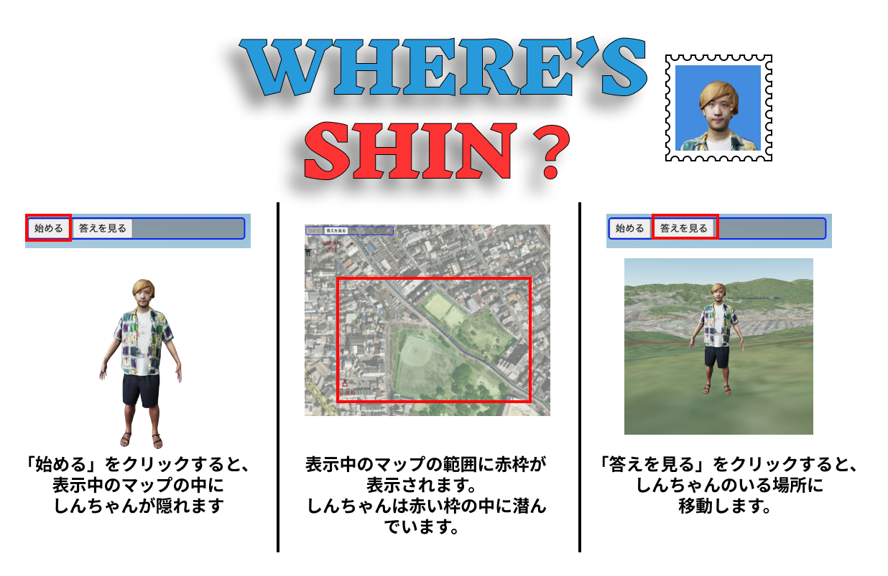
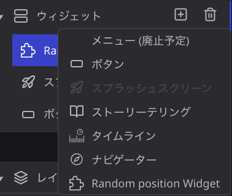
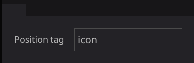
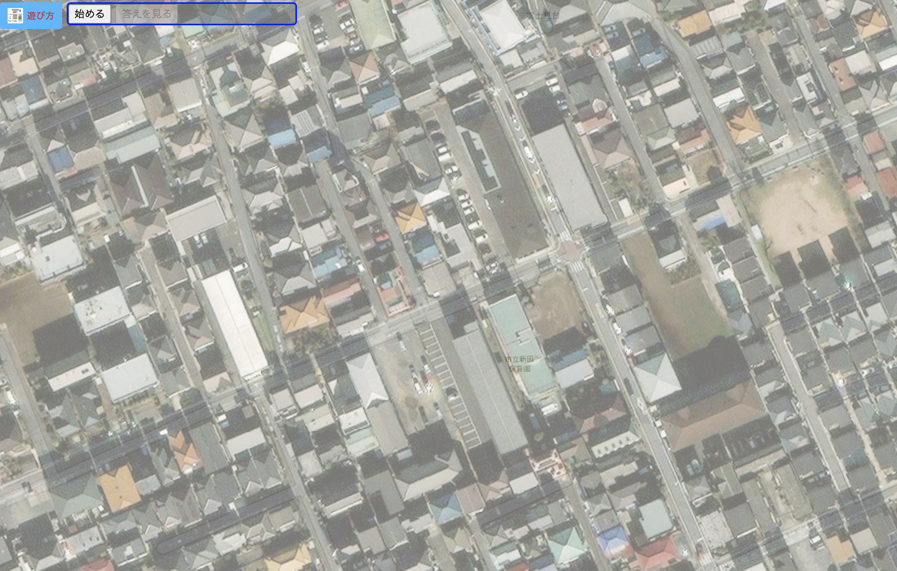
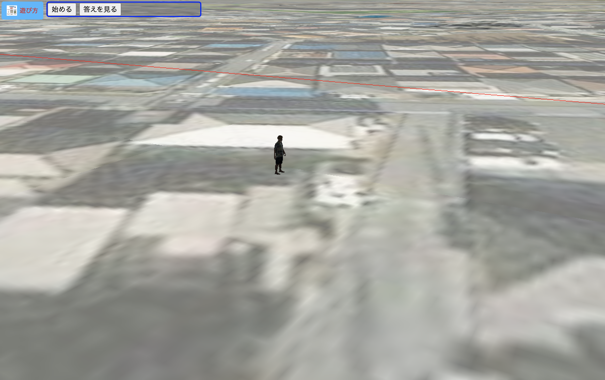

# Where is plugin
このプラグインでは、マーカーや3Dモデルなどのレイヤを表示中の地図の範囲ないにランダム配置します。
ユーザーはランダムに配置されたオブジェクトを探して楽しむことができます。そう、まるでウォーリーを探せみたいに。

## 設定方法
- プラグインをインストールしたら、ウィジェットから「 Random Position plugin」を追加します。

- ウィジェットの設定で、Position Tagにレイヤーに設定したタグ名を入力します。（あらかじめマーカーや3Dモデルレイヤに任意のタグを指定しておいてください）。  

## 使い方
- 「始める」ボタンを押下すると、表示中のマップのどこかに、タグで指定したレイヤーをランダムに移動させます。

- どこに配置されるか探してみましょう。
- 「答えを見る」を押下すると、答えの場所にマップが移動します。

